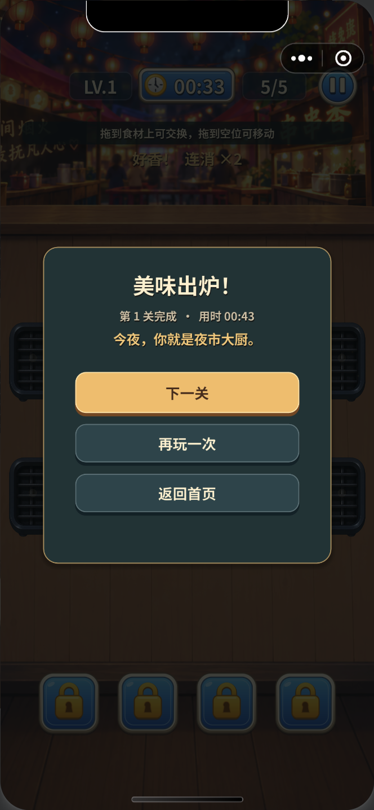
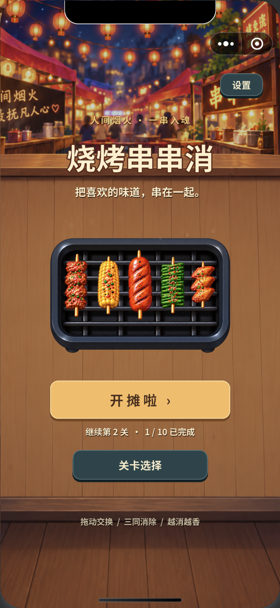

# 微信小游戏导出

新电脑从 [新 Mac 迁移与 Codex 交接指南](new_mac_setup.md) 开始。本页记录本仓库的实际导出方式和已遇到的故障；根目录《Godot导出微信小游戏指南.md》是初始路线参考，当前已有固定模板、维护脚本和回归测试，无需重复首次选型或重建最小演示工程。

截至 2026-09-25：Android 曾由用户反馈能进入并操作；iPhone 16 Pro 在只读属性修复后仍出现空白，最新首帧诊断包的真机结果待反馈。以下历史验证记录不能作为 iPhone 已修复的结论。

## 本次交付

- AppID：`wxd575463c13869e7d`；游戏名：烧烤串串消。
- 工程：`build/wechat/`，压缩包：`build/wechat.zip`。
- 导入微信开发者工具时选择 **`build/wechat`**，不要选择 Godot 项目根目录。
- 竖屏、Compatibility、单线程；十关资源、中文字体和短音效均在本地包内。
- 构建目录被 Git 忽略，提交的是导出脚本、启动配置和说明。

## 导出方法与版本

沿用用户提供指南中的 [godothub/godot-minigame](https://github.com/godothub/godot-minigame) 适配路线。下载其 [4.7.0.8 模板](https://github.com/godothub/godot-minigame/releases/tag/4.7)，使用 Godot 命令行打包资源，再组装微信运行时工程。

本机 Xcode 尚未接受许可，无法编译该插件的 macOS C++ 编辑器面板。本次没有安装面板，也没有替用户接受许可；命令行脚本复用了该插件发布的适配层、引擎和启动器，不需要官方 Web 导出模板，不生成 HTML 套壳。

| 部件 | 实际版本 |
| --- | --- |
| 开发用 Godot | `4.7.2.stable.official.ed1daf0bf` |
| 微信模板 | `minigame4.7.0.8.tpz` |
| 微信运行内核 | `4.7.2.rc.custom_build.a71c91099` |
| 开发者工具 | Stable `2.02.2608070` |
| 微信基础库 | `3.15.2`（模板原配置） |

编辑器与模板内核不是完全相同的构建，已在本机模拟器验证兼容。微信预设使用 GDScript 文本导出，避免跨构建的脚本二进制标记差异。模板固定 SHA-256：

```text
6e9938ec4f8de0cd9b693a1d851a6b361a7397d6f3ee6a6de4909b053bac8a23
```

## 再次导出

在仓库根目录运行：

```bash
python3 tools/export_wechat.py
```

首次下载模板到 `build/cache/`，后续复用本地缓存，使用前仍校验 SHA-256。可通过 `--godot /path/to/godot` 指定引擎，通过 `--template /path/to/minigame4.7.0.8.tpz` 使用已有模板，通过 `--appid wx...` 指定其他小游戏。

脚本将替换其先前生成的 `build/wechat/`，因此不要直接在构建目录维护代码。启动逻辑编辑 `platform/wechat/game.js`，资源过滤编辑 `export_presets.cfg` 的 `WeChat Resources` 预设。

输出结构：

```text
build/wechat/
├── game.js
├── boot-diagnostics.js
├── boot-options.js
├── game.json
├── project.config.json
├── weapp-adapter.js
├── glx-config.js
├── godot-loader.js
├── THIRD_PARTY_NOTICES.txt
├── export-info.json
├── images/
└── engine/
    ├── game.js
    ├── bbq.bin
    ├── godot.js
    ├── godot-sdk.js
    └── godot.wasm.br
```

`bbq.bin` 内部是 Godot PCK。必须保留 `.bin` 扩展名：本次实测 `.pck` 被微信打包文件过滤器排除，运行时无法打开资源。引擎与资源作为 `engine` 分包加载，模板示例资源、示例分包和私人编辑器配置不进入交付包。`export-info.json` 记录模板来源、校验值和文件大小。

本机开发者工具对 Emscripten 引擎执行二次压缩时，预览打包线程会退出。导出配置已关闭 SWC 和额外 JS 压缩，重新生成预览成功。关闭“忽略未使用文件”，保证动态加载的 WASM 和资源包被打入预览。

微信启动文件将 `wx.onHide` / `wx.onShow` 转发到 Godot 适配层的失焦／聚焦事件，使用游戏现有的失焦暂停逻辑。存档沿用 `user://progress.cfg`，由模板文件系统适配持久化；当前音效均为短 WAV，继续通过 Godot 混音播放。

## 构建排错速查

| 表现 | 已确认原因或首先检查的事项 | 当前处理与验证 |
| --- | --- | --- |
| 新机缺 `.godot/`、找不到导入资源 | Git 不携带生成的导入缓存 | 打开 `project.godot` 等待导入，或运行 Godot `--headless --path . --import`，确认无资源／脚本错误 |
| 为安装导出插件卡在 C++、Xcode 许可 | 进入了本项目未采用的编辑器插件编译路线 | 使用 `tools/export_wechat.py` 组装已发布模板；当前资源打包不依赖此插件或官方 Web 模板 |
| 模板下载失败、SHA-256 不符或补丁匹配失败 | 网络、下载不完整或模板版本不符 | 核对脚本固定版本／校验值，重新取得匹配的原始文件；保留校验与精确补丁保护，不强行跳过 |
| 平台测试找不到 `.tpz` | 测试读取默认缓存，而 `build/` 不在 Git 中 | 首次导出准备 `build/cache/minigame4.7.0.8.tpz` 后再测；自定义模板路径不会自动填充默认缓存 |
| 手机找不到主资源包 | 曾直接使用 `.pck`，被微信包文件过滤 | 脚本将资源重命名为 `engine/bbq.bin`；核对入口路径与预览包是否包含该文件 |
| 预览时打包线程退出 | 旧机对 Emscripten JS 二次压缩曾失败 | 保持脚本中的 `minified=false`、`swc=false`、`disableSWC=true`，重新预览确认成功 |
| WASM／资源在本地存在，扫码却缺失 | 检查是否被当成“未使用文件”排除 | 保留 `ignoreUploadUnusedFiles=false`；核对预览包体和 engine 分包，不能只看本地目录 |
| 导出后报 `module 'game.js' is not defined` | 工程目录替换后，工具可能仍缓存旧文件列表 | 导出前关闭该工程窗口，导出后重新打开；不以删除玩家存档作为常规处理 |
| `module 'boot-options.json.js' is not defined` | 微信模块加载器无法按 Node.js 方式 require 该 JSON | 配置已改成导出脚本生成的 `boot-options.js`，通过 CommonJS 导出；核对正在打开最新产物 |
| iOS `Attempted to assign to readonly property` | SDK 强制写入 DPR，与加载器只读 getter 冲突 | 保留 `sdk-preserve-device-pixel-ratio` 补丁；平台测试覆盖原错误及修复后初始化 |
| 加载器已清理却又绘制／resize | 图片、进度和排队回调可晚于 cleanup 到达 | 保留 `loader-stop-after-cleanup` 补丁；回归测试验证清理后的回调不再绘制或改画布 |
| 能看到加载页，但游戏空白 | 仅凭加载进度不能判断引擎、场景、首帧成功；具体原因仍需日志 | 用 `--diagnostics`，核对构建号、首帧、尺寸、GL 状态和错误，结合手机截图判断；不直接宣布渲染问题已修复 |
| iPhone 调试二维码显示 Android | 本机 iOS 真机调试还要求 USB 和相应微信版本 | 可继续使用普通“预览”扫码诊断；需要 USB 调试时按工具当前提示连接，而非反复扫描 Android 调试码 |
| 新 Mac 的 CLI 无法调用微信工具 | 登录、服务端口、调用授权属于本机状态 | 由用户完成该机登录和必要授权；手动预览可作为入口，不照搬旧端口号或旧登录状态 |
| 普通构建打开了另一版游戏 | 同名原生 JS 工程和旧最小测试工程容易混淆 | 核对路径必须是当前 Godot 检出下的 `build/wechat/`；目录用途见新 Mac 指南 |

排错应保留当前 Git 提交号、`build/wechat/export-info.json`、`build/wechat-export.log`、预览反馈和手机诊断截图。同一问题先沿记录中已验证的路径排查；只有版本、输入或代码发生相关变化时，才重做相应验证。

## 验证记录（2026-09-24）

1. 独立最小工程成功导出、显示图片和按钮；随后验证完整游戏。
2. 完整导出包在微信模拟器启动，中文、透明食材、烤盘和背景正常。
3. 实际拖拽完成第一关：移动、交换、三消、连消、结算、解锁和进入第二关。
4. 停止并重新编译模拟器后，首页恢复“继续第 2 关 · 1/10 已完成”，确认小游戏存档持久化。
5. 运行日志未检出脚本／资源错误；Godot 资源包也通过桌面引擎启动检查。
6. 微信开发预览包生成成功：服务端反馈总包体 13,134,589 字节，主包 101,535 字节，engine 分包 13,033,054 字节；本地预览二维码为 `build/wechat-preview.png`。
7. 游戏核心规则没有修改，复用此前核心测试结果；本次主要验证新的导出与微信运行路径。

通关与重启证据：





手机端尚需验收：iOS / Android 真机触摸、音效听感、前后台切换暂停、异形屏安全区域和性能。模板保留 `iOSHighPerformance` / `iOSHighPerformance+` 配置；iOS 对应能力是否可用，以小游戏后台实际开通状态为准。未接入广告、分享、登录或付费能力，未提交审核或正式发布。

## 手机开发预览

本次已生成 `build/wechat-preview.png`，可用有开发权限的微信扫码。二维码会过期；届时在开发者工具中点“预览”重新生成，或在已授权服务端口／CLI 的环境执行：

```bash
/Applications/wechatwebdevtools.app/Contents/MacOS/cli preview --project "$PWD/build/wechat" --qr-format image --qr-output "$PWD/build/wechat-preview.png"
```

已完成的是开发预览包生成，手机上的实际运行仍需扫码验收。

## 真机停在加载页时

- 先核对工程路径为本项目的 `build/wechat/`。`/private/tmp/bbq-wechat-smoke` 是首次导出时的最小测试工程，不是完整游戏。
- “正在摆好烤盘”由模板在分包下载成功后显示，不能据此判断 WASM 初始化或游戏启动成功。
- 启动入口现在捕获同步异常、启动 Promise 拒绝和微信未处理异常，在手机弹窗显示阶段、微信／基础库版本、运行模式与错误详情。成功启动后移除这些启动诊断监听，不干预游戏中的错误处理。
- 诊断逻辑回归检查：`node --test tests/wechat_boot.test.cjs`。普通预览也能显示启动错误，无需 USB；弹窗用于定位，不代表已修复真机故障。
- 根据[模板作者的 iOS 指南](https://get.godots.app/docs/app/ios)，后台需开通高性能模式，且 `game.json` 保留两个 iOS 开关。后台开通状态仍需账号持有人确认。
- 本机开发者工具的 iOS 真机调试提示要求微信 8.0.61 以上及 USB 连接；二维码面板选中 Android 时不能用于 iPhone 调试。普通“预览”不受此调试连接条件限制。
- 导出会替换构建目录。若开发者工具仍使用旧文件列表并报 `module 'game.js' is not defined`，关闭该工程窗口后重新打开，重新扫描文件；不需要清理游戏存档。

### iPhone 只读像素比例错误（2026-09-24）

用户反馈同包在 Android 可以启动和操作。iPhone 16 Pro 的诊断弹窗显示微信 8.0.78、基础库 3.17.3、普通模式，在加载分包时抛出 `Attempted to assign to readonly property`，位置为 `godot-sdk.js:1:27905`。

已定位为模板 SDK 的 iOS 分支执行 `window.devicePixelRatio = 1`，与加载器创建的只读 getter 冲突。导出脚本在校验原模板后移除 SDK 的旧像素比例覆盖逻辑，保留高性能模式提醒，让加载器按设备信息管理像素比例；不修改引擎或 WASM 版本。补丁要求精确匹配一次，否则中止导出，避免换模板后静默误改。构建清单的 `runtime_patches` 记录此补丁。

运行 `node --test tests/wechat_sdk.test.cjs tests/wechat_boot.test.cjs` 可验证原模板复现错误及修复后的完整 SDK 初始化。测试使用已缓存并校验 SHA-256 的模板，覆盖 iOS 只读 getter、只读／可写属性及 Android、模拟器、mac 分支。此验证不替代 iPhone 修复包的扫码验收；普通模式下是否存在后续 WASM 或渲染限制，仍以真机结果为准。

本次 17 项检查通过，修复包在微信模拟器正常进入首页，未发现启动脚本或资源错误；普通预览包生成成功，二维码位于 `build/wechat-ios-fix-preview.png`。随后用户反馈 iPhone 能通过加载页，但游戏画面空白；只读属性问题已不再阻止加载，不能据此认定真机启动成功。

### 加载后空白的首帧诊断（2026-09-24）

已确认模板加载器的 `cleanup()` 释放 GL 资源后，图片 onload、分包进度及排队的动画帧仍可调用 `render()`。回归测试复现了释放后的绘制。导出补丁增加结束标记，阻止后续绘制、resize 和重复清理；该缺陷是否为 iPhone 空白的直接原因仍需真机验证。

启动入口沿用模板公开的 Engine API，保留 SDK 初始化与 `GODOTSDK.engine`，接入 Godot stdout、stderr 和退出码。引擎启动 Promise 完成后继续等待场景与首帧信号，不再提前移除错误监听。游戏仅在 `wechat` 导出中打印一次场景尺寸和 `RenderingServer.frame_post_draw` 信号。此信号表示 Godot 完成一次绘制，不能单独证明手机屏幕已正确显示。

普通导出在收到首帧后解除启动监听；30 秒未收到首帧则显示当前状态与最近的 Godot 错误。排查包使用：

```bash
python3 tools/export_wechat.py --diagnostics
```

诊断包即使收到首帧，也会在 3 秒后显示一次状态，包含构建编号、微信版本、运行模式、WXGLX/WebGL2、画布和绘图缓冲尺寸、上下文丢失状态及 GL 错误。关闭弹窗后可继续检查游戏。下次正常导出不带 `--diagnostics`，即可取消成功时的诊断弹窗；不要将诊断包用于正式发布。

相关验证命令：

```bash
node --test tests/wechat_boot.test.cjs tests/wechat_sdk.test.cjs tests/wechat_loader.test.cjs
```

另建的 `build/wechat-webgl-check/` 用于强制普通 WebGL 的本机对照，在修改前已能显示首页；它不代表 iOS 真机兼容结论，也不是手机本轮要扫描的工程。

本轮验证：26 项 JavaScript 回归检查、18 项 Godot 页面／输入检查通过；重新导出成功。微信模拟器显示完整首页，诊断报告场景尺寸 `720×1558`、首帧已绘制、WebGL2 画布／缓冲均为 `1170×2532`、上下文未丢失、GL 错误为 0。普通预览二维码输出至 `build/wechat-ios-render-preview.png`；iPhone 仍需扫码并提供该包的诊断结果，不能用模拟器结果代替真机验收。
